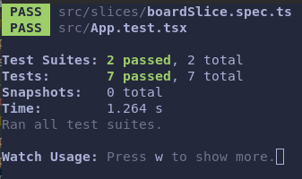

This project is based on React/Redux with Typescript. 

## Quickstart
You can use the available image in [Docker Hub](https://hub.docker.com/repository/docker/dsegoviat/react-cards) 
to quickly get the application running.

`docker run -it -p 3000:3000 dsegoviat/react-cards`

Application will be running on https://localhost:3000.

If you want to run your own development server, please check **Usage** section.

## Usage
First, install all required npm packages. I have used Node `v16.13.0`.

`npm install`

To run the development server:

`npm start`

## Testing

You can run tests by executing. 

`npm test`

See [running tests](https://facebook.github.io/create-react-app/docs/running-tests) for
more information.

## Run locally with docker

Build the docker container.

`docker build -f Dockerfile -t cards .`

Start container from local image.

`docker run -it -p 3000:3000 cards`

## Features
This solution includes the following features:
- Cards CRUD (with default image)
- Sorting by title and creation date
- Application state is stored in localStorage
- Reducer testing
- Minimal App component testing